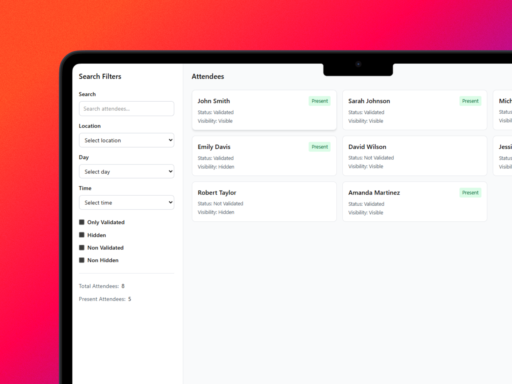
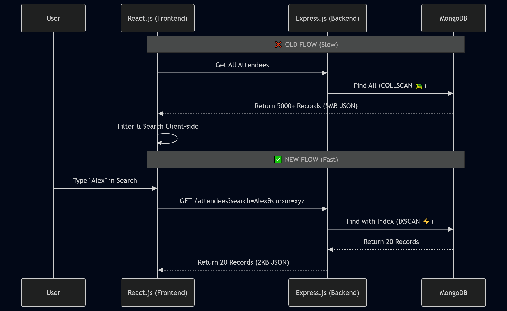

# 🏊 Swimming School Management Platform - Performance & Architecture Refactor

> **⚠️ Note:** This repository documents the technical architecture, performance optimizations, and feature implementations for a client project protected under NDA. No source code is included.

**Role:** Full Stack Developer | **Timeline:** 10 Months | **Team Size:** 2 | **Status:** Live 🟢

### Built With

*A wireframe of the main dashboard, showcasing the complex data relationships and filters that required backend optimization.*

## 🚀 Project Overview

A comprehensive management SaaS for a swimming school handling scheduling, attendance tracking, and billing for hundreds of active students.

---

## ⚡ Key Challenge: The "Data Bottleneck"

The initial MVP handled data fetching inefficiently. As the user base grew, the application experienced severe latency (**3-5s load times**) on the main dashboard, affecting the admin team's ability to check in students quickly especially in places with poor internet connectivity.

### Problems Identified:

1.  **Client-Side Filtering:** The API originally sent *all* records to the frontend to be filtered. This bloated the JSON payload and froze the UI.
2.  **Database Scans (COLLSCAN):** The database was performing full collection scans for filtered queries, spiking CPU usage.
3.  **Inefficient Query Plans:** Complex sorting logic (e.g., "Find active students by Coach X sorted by Name") prevented the use of simple indexes.

---

## 💡 The Solution: 90% Performance Boost

### 1. Database Optimization (Cursor Pagination & Indexing)

I refactored the data fetching logic to implement **Infinite Scrolling** using Cursor-Based Pagination. I also analyzed the query patterns and implemented a **Compound Index** to cover the most frequent filter combinations.

* **Before:** Fetch all + Filter Client side → **1.23 seconds**
* **After:** Fetch specific page (Indexed) → **0.12 seconds**

**Result:** Query time dropped from **~1230ms to <120ms**.

### 2. Moving Logic to the Backend

I migrated the search and filter logic from the React.js frontend to the Express backend and implemented a debounced search mechanism.

* Built a **Dynamic Query Builder** service in Express to construct MongoDB aggregation pipelines based on active filters (Status, Membership Type, Coach).

### ⚡ Performance Benchmark

| Metric | Before Optimization | After Optimization | Improvement |
| :--- | :--- | :--- | :--- |
| **Latency (Avg)** | 1.23s | **0.12s** | 🚀 **10x Faster** |
| **Docs Scanned** | 8,000 docs | **300 docs** | 📉 **96% Reduction** |
| **Query Type** | `COLLSCAN` (Full Scan) | `IXSCAN` (Indexed) | ✅ Optimized |

---

## 👥 Feature Spotlight: Coach Assignment System

Beyond optimization, I engineered a robust system for managing coach-attendee relationships with strict business logic validation.

### Complex Business Logic Implemented:

* **Assignment & Transfer:** Admins can assign attendees to coaches and transfer them while preserving historical data.
* **Capacity Limits:** The system enforces strict group limits based on membership type.
    * *Logic:* `IF (CurrentGroupSize >= MaxCapacity) THROW AssignmentError`.
* **Coach Dashboard:** A dedicated view for coaches to see their roster.

---

## 📈 Results & Impact

* **Performance:** API response time reduced by **~90%** for listed endpoints.
* **Efficiency:** Drastically reduced server bandwidth usage by serving paginated data.
* **Architecture:** Shifted from an **O(N) linear scan** (which slows down as data grows) to an **O(1) indexed lookup**.
    * *Impact:* This ensures the query speed remains constant (0.12s) even if the database grows from 8,000 to 100,000+ records.
* **UX:** Achieved "Instant Search" feel for end-users via backend filtering and debouncing.

These are the most important technical highlights of the project. I also implemented various other features and fixed bugs across the stack during the 10-month development cycle.
